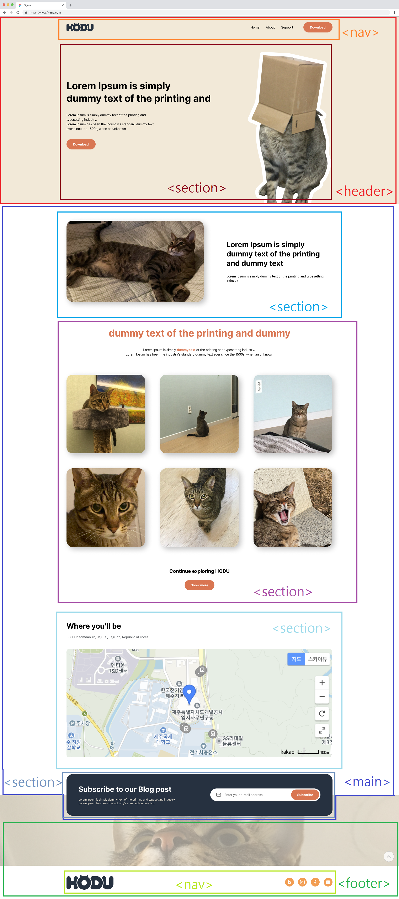
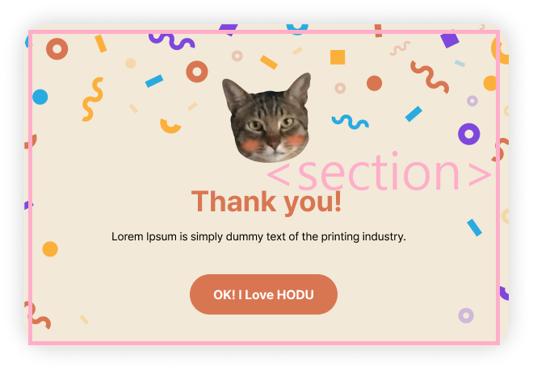
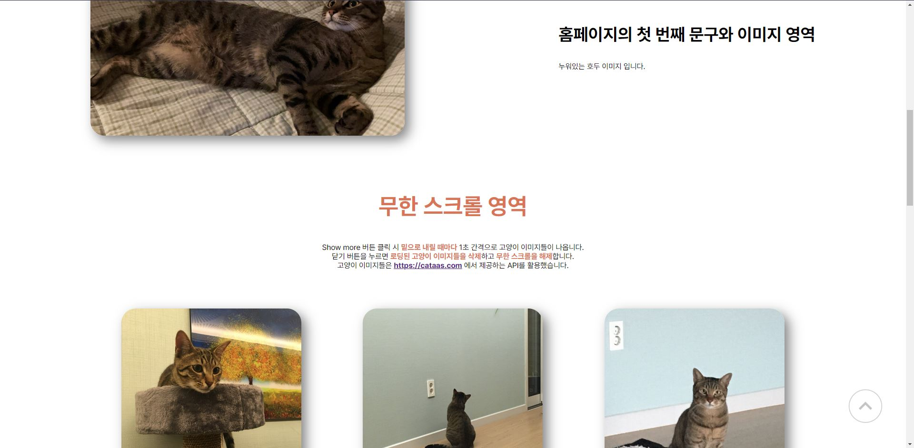
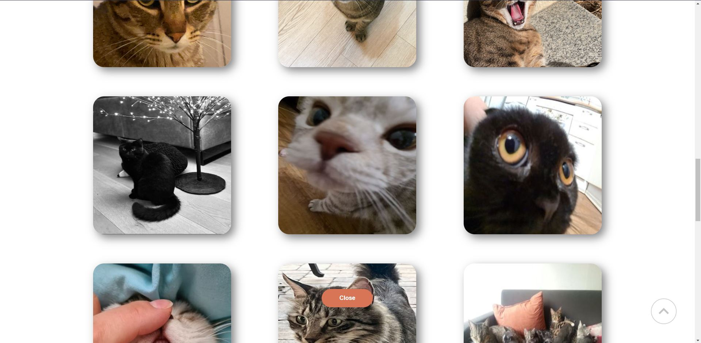
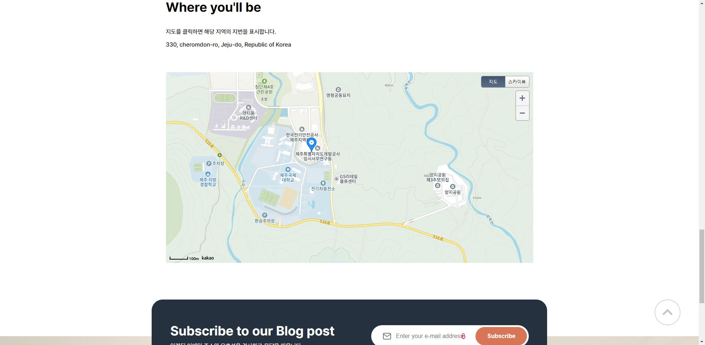
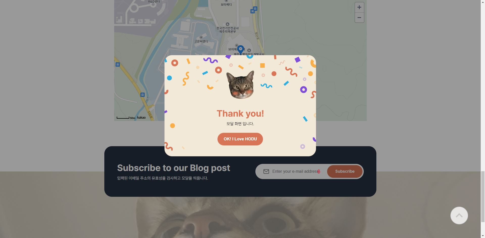

# ormi-HTML-CSS-JS-mini_project (오르미 백엔드 4기)

---

## 프로젝트 설명
>백엔드 개발자로서 가져야 할 기초 프론트엔드 역량 향상을 위한 오르미 백엔드 4기 프론트엔드 미니 프로젝트 입니다.<br>
>최대한 ***Semantic 하게 HTML 코드를 작성*** 하고 ***CSS 를 통한 문서와 스타일의 분리*** , ***JavaScript 로 동적인 페이지를 구성*** 하고 ***외부 API를 활용*** 하는 것을 주요 목표로 학습하고 프로젝트를 진행했습니다.

---

## Skills & IDE
### Skills


### IDE


---

## 프로젝트 구성
```
│ index.html
├─css
├─img
└─js
    ├─hover
    ├─inf_scroll
    ├─kakao_map
    └─modal
```

---

## 주요 구현 사항
### HTML 화면의 개략적인 구성
* **주요 화면 구성**

  
* **모달 화면**

  
```html
<header>
	<nav>     -> 링크와 다운로드 버튼
	<section> -> 홈페이지 메인 안내 문구와 대표 이미지

<main>
	<section> -> 홈페이지의 첫 번째 문구와 이미지
	<section> -> 이미지 무한 스크롤 영역
	<section> -> 카카오 맵 영역
	<section> -> 구독 문구와 이메일 입력 구역

<section>         -> 구독 버튼 클릭 시 나타나는 모달 영역

<footer>
	<nav>     -> 블로그, 인스타그램, 페이스북, 유튜브 링크
```
### CSS
* 각 `<section>` 의 제목 요소를 숨겨주기 위한 IR 기법 적용
  ```css
  .txt-hide {
    clip-path: inset(50%);
    width: 1px;
    height: 1px;
    margin: 0;
    overflow: hidden;
  }
  ```
* `display: flex` 와 `flex-direction` , `align-items` 속성들로 내부 요소 정렬
* 세부 간격 조절은 `margin` 속성을 이용
* JavaScript로 요소 추가/숨기기 기능 구현을 고려해 `display: none` 속성을 가지는 hidden 클래스 작성
  ```css
  .modal-hidden {
    display: none;
  }
  .show-more-hidden, .close-hidden {
    display: none;
  }
  ```
* 카카오 맵 스타일은 기본 제공 스타일을 적용
### JavaScript
* ***kakao_map 폴더***
  * **mapInit.js**
    * 카카오 지도 생성 및 초기 위치 마커 추가
  * **map_getAddress.js / map_getAddress_functions.js**
    * 지도에 마우스 클릭 시 마커를 표시하는 이벤트 리스너 추가
    * 마우스로 클릭한 지역의 지번을 가져와 HTML 문서에 추가하는 기능 구현
  * **map_userControl.js / map_userControl_functions.js**
    * 카카오 지도의 지도 컨트롤 버튼 리스너 추가
    

* ***inf_scroll 폴더***
  * **inf_scroll.js / inf_scroll_functions.js**
    * 버튼 클릭 시 외부 API를 통해 이미지 파일을 받아 밑으로 계속 추가해주는 무한 스크롤 기능 구현
    * 쓰로틀링을 적용해 과도한 이미지 로딩을 방지
    * 닫기 버튼으로 무한 스크롤 이벤트 리스너 삭제 기능 추가
    

* ***modal 폴더***
  * **modal.js / modal_functions.js**
    * 입력받은 이메일 주소의 유효성 검사 기능 구현
    * 모달 추가 및 감추기 기능 구현
    

* ***hover 폴더***
  * **hover.js**
    * 맨 위로 이동 버튼의 이밴트 리스너 추가
---

## 구현 화면






---

## Git Commit Convention
```
Feat - 새로운 기능을 추가
Fix - 버그 수정
Design - CSS 등 사용자 UI 디자인 변경
Style - 코드 포맷 변경, 세미 콜론 누락, 코드 수정이 없는 경우
Refactor - 프로덕션 코드 리팩토링
Comment - 필요한 주석 추가 및 변경
Docs - 문서 수정
Rename - 파일 혹은 폴더 명을 수정하거나 옮기는 작업만인 경우
Remove - 파일을 삭제하는 작업만 수행한 경우
```

---

## Github Pages
<https://jinhwanjung-0125.github.io/JinhwanJung-0125-ormi-HTML-mini_project.github.io>

---

## 사용한 API
**카카오 맵 API** : <https://apis.map.kakao.com/web/guide>

**CATAAS API** : <https://cataas.com>